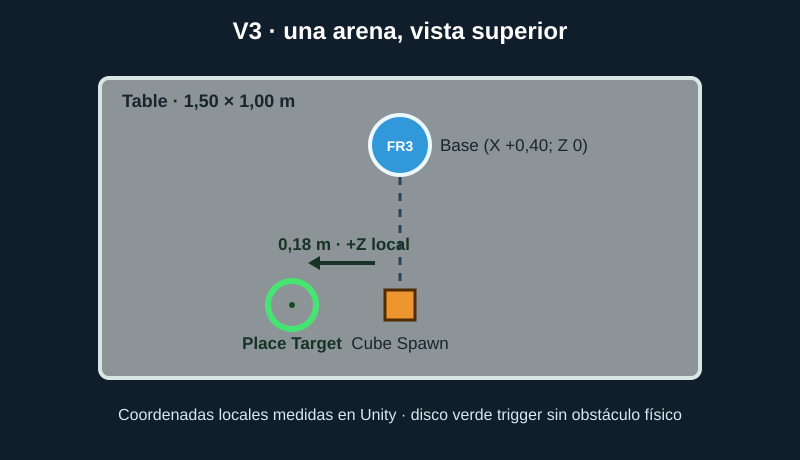

# PickPlaceRL

Proyecto de Unity 6.3 LTS para manipular un cubo con un Franka FR3 y ML-Agents. V2 documenta el resultado de **Reach** con cubo fijo. V3 añade un entorno separado para aprender **pick and place**; sus resultados de aprendizaje aún no están demostrados.

## V2 - Reach: situación y resultado histórico

- `Assets/Scenes/SampleScene.unity` contiene el robot `fr3`, la mesa `Table` y el cubo `TestObject`. El Franka tiene siete articulaciones y pinza física de dos dedos.
- `RobotPickSequence.cs` conserva las posturas calibradas Home, Pre-Pick y Pick. Según la prueba manual del proyecto, permite agarrar y levantar físicamente el cubo. La secuencia no incluye una fase de depositarlo en otro lugar; no se han cambiado esas posturas, el URDF, los colliders, las masas ni el agarre.
- `FrankaLiftAgent.cs` es el agente de entrenamiento. Tiene dos etapas seleccionables en el Inspector: `Reach` y `Lift`. `Reach` es el valor inicial. La etapa de transporte y colocación está pendiente.
- La arena se agrupa como `Assets/Prefabs/TrainingArena.prefab`. Tras el benchmark corto, `SampleScene` está configurada con `numberOfArenas = 16`. El spawner asigna `arenaId` desde 0 y todas las instancias comparten la política `FrankaLift`.
- `trainer_config.yaml` configura PPO. El antiguo run `franka_reach_v1` solo contiene una muestra agregada a 10 000 pasos; el run local `franka_reach_v2` ya muestra éxito sostenido en Reach con cubo fijo, descrito más abajo.
- La escena usa `Behavior Name = FrankaLift`, 23 observaciones vectoriales, 8 acciones continuas y `Decision Requester` cada 5 pasos físicos, con acciones entre decisiones.

## Ejecutar primero una arena

1. Abre esta carpeta en Unity Hub con **Unity 6000.3.25f1** y carga `Assets/Scenes/SampleScene.unity`.
2. Para la comprobación inicial, cambia temporalmente `numberOfArenas` de 16 a 1. En `TrainingArena/fr3/FrankaLiftAgent`, selecciona `stage = Reach` y deja `randomizeCube` desactivado. Para entrenar con las 16 arenas ya validadas, vuelve a poner 16 y guarda la escena.
3. En `fr3`, comprueba `Behavior Parameters`: `Behavior Name = FrankaLift`, `Vector Observation Space Size = 23`, `Continuous Actions = 8`, `Discrete Branches = 0`, `Behavior Type = Default`, sin modelo. Deja `Decision Requester` activado con `Decision Period = 5` y `Take Actions Between Decisions` activado.
4. Arranca `mlagents-learn` en PowerShell con los comandos de abajo. Cuando indique que espera al Editor, pulsa **Play** en Unity.

Se usa `Decision Requester` porque ya está configurado en la escena y mantiene una cadencia física estable; no se llama a `RequestDecision()` desde el agente. Al pulsar Play sin entrenador, `Behavior Type = Default` usa `Heuristic()` como alternativa. Haz clic en la vista **Game** para darle foco: `1/2`, `3/4`, `5/6`, `Q/E`, `A/D`, `Z/C` y `R/F` mueven las siete articulaciones; **Espacio** cierra la pinza y soltarlo la abre. Para ver aprendizaje real hace falta el entrenador.

El script `RobotJointController.cs` es una herramienta de control manual por Inspector. No debe habilitarse junto al agente o `RobotPickSequence` porque los tres escribirían sobre los mismos `ArticulationDrive`.

### Repetir la demostración manual

Mantén `numberOfArenas = 1`. En `TrainingArena/fr3`, desactiva `FrankaLiftAgent` y `Decision Requester`, añade el componente `RobotPickSequence` y asigna `Joint Bodies` con tamaño 7 en orden `link1`…`link7`. Asigna también `fr3_leftfinger` y `fr3_rightfinger` a los dos campos de la pinza. Pulsa **Play**: la secuencia empieza en `Start()`, recoge el cubo y vuelve a Home con él sujeto. Esta preparación puede quedar como override de la instancia de la escena; para entrenar, vuelve a desactivar la secuencia y a activar el agente y `Decision Requester`.

## Entorno Python en Windows 11 con venv

La parte Unity instalada es `com.unity.ml-agents` **4.1.0**. Su [código de la rama 4.1.0](https://raw.githubusercontent.com/Unity-Technologies/ml-agents/release/4.1.0/ml-agents/mlagents/trainers/__init__.py) declara Python `mlagents` **1.2.0.dev0** y su [setup.py](https://raw.githubusercontent.com/Unity-Technologies/ml-agents/release/4.1.0/ml-agents/setup.py) exige Python **3.10.1–3.10.12**. Usa **Python 3.10.12 de 64 bits**. La versión publicada en PyPI 1.1.0 corresponde a otra publicación; aquí se instala la rama `release/4.1.0` para emparejar las dos partes.

Python.org no distribuye instalador de Windows para 3.10.12: fue una versión publicada solo como código fuente. En este equipo se instaló **Python 3.10.12 dentro de `.python31012/`** mediante `uv`, únicamente para obtener el intérprete. El entorno de paquetes usa el `venv` y `pip` estándar de Python, sin conda. Si partes de una copia nueva del proyecto, instala primero el intérprete así:

```powershell
cd 'C:\Users\agust\OneDrive\Escritorio\modelado\t1\PickPlaceRL'
$uvZip = Join-Path $env:TEMP 'codex-uv-win64.zip'
$uvHome = Join-Path $env:TEMP 'codex-uv-win64'
Invoke-WebRequest 'https://github.com/astral-sh/uv/releases/latest/download/uv-x86_64-pc-windows-msvc.zip' -OutFile $uvZip
Expand-Archive -LiteralPath $uvZip -DestinationPath $uvHome -Force
& (Join-Path $uvHome 'uv.exe') python install 3.10.12 --install-dir '.python31012' --no-bin --no-registry
& '.\.python31012\cpython-3.10.12-windows-x86_64-none\python.exe' --version
& '.\.python31012\cpython-3.10.12-windows-x86_64-none\python.exe' -m venv .venv
.\.venv\Scripts\Activate.ps1
python -m pip install --upgrade pip setuptools wheel
if (!(Test-Path '.mlagents-src')) { git clone --depth 1 --branch release/4.1.0 https://github.com/Unity-Technologies/ml-agents.git .mlagents-src }
python -m pip install 'torch==2.2.2'
python -m pip install .\.mlagents-src\ml-agents-envs
python -m pip install .\.mlagents-src\ml-agents
python -m pip check
python -c "from importlib.metadata import version; print(version('mlagents'), version('mlagents_envs'))"
mlagents-learn --help
```

Los dos números impresos por Python deben ser `1.2.0.dev0`. La combinación verificada en este equipo está fijada en `scripts/setup_training_env.ps1`: Python 3.10.12, ML-Agents 1.2.0.dev0, torch 2.2.2+cpu, setuptools 80.9.0, protobuf 3.20.3, numpy 1.23.5 y TensorBoard 2.20.0. `.python31012/`, `.venv/`, `.mlagents-src/`, `results/` y `TrainingLogs/` están excluidos de Git. El clon de ML-Agents está en el commit `ee0a08ccae597094003844d0121317f9790a1676` de `release/4.1.0`.

Si PowerShell bloquea la activación, usa una sesión que permita scripts locales para tu usuario (`Set-ExecutionPolicy -Scope CurrentUser RemoteSigned`) o ejecuta los comandos con `.\.venv\Scripts\python.exe` sin activar el entorno.

Para el siguiente entrenamiento limpio, con `stage = Reach`, `numberOfArenas = 16` y `trainingRunName = franka_reach_v2` como queda guardado en la escena:

```powershell
cd 'C:\Users\agust\OneDrive\Escritorio\modelado\t1\PickPlaceRL'
.\scripts\train.ps1 -RunId franka_reach_v2
```

Cuando la terminal muestre que espera a Unity, pulsa **Play** en el Editor. No se usa `--env` porque el entorno corre dentro del Editor. Para detenerlo, interrumpe primero el entrenador con **Ctrl+C** una vez y espera a que guarde el checkpoint; después detén Play. Si necesitas reanudar el mismo experimento:

```powershell
.\scripts\train.ps1 -RunId franka_reach_v2 -Resume
```

Abre otra ventana de PowerShell, activa el mismo `venv` y abre TensorBoard:

```powershell
cd 'C:\Users\agust\OneDrive\Escritorio\modelado\t1\PickPlaceRL'
.\.venv\Scripts\Activate.ps1
tensorboard --logdir .\results --port 6007
```

Abre [http://localhost:6007/](http://localhost:6007/). **En este PC, Windows reserva el puerto 6006** (`netsh int ipv4 show excludedportrange protocol=tcp`), por lo que `tensorboard --logdir .\results --port 6006` no puede abrirlo. TensorBoard 2.20.0 se comprobó con HTTP 200 en 6007. No es necesario modificar las reservas de puertos del sistema.

## Curriculum manual

1. **Reach:** una arena, cubo fijo, `stage = Reach`. El episodio termina al acercar el TCP a menos de `reachDistance` (por defecto 7 cm). Observa que la distancia mínima baje y la tasa de éxito suba antes de seguir.
2. **Lift:** cambia el mismo componente a `stage = Lift`; mantén la misma forma de observaciones y acciones. Puedes inicializar la red con el experimento anterior:

   ```powershell
   mlagents-learn .\trainer_config.yaml --run-id=franka_lift_v1 --initialize-from=franka_reach_v2
   ```

   El éxito requiere elevar el cubo `targetHeight = 0.15 m` por encima de su altura inicial. Esta etapa puede requerir más pasos que Reach; aumenta `max_steps` de forma explícita tras revisar las curvas de aprendizaje.
3. **Variación pequeña:** una vez que Lift sea estable con el cubo fijo, activa `randomizeCube` y empieza con `cubeRandomXZ = 0.03 m`. Amplía el rango solo cuando la tasa de éxito se mantenga.
4. **Pick-and-place:** requiere añadir un destino, observaciones cubo→destino, fase de transporte y recompensa de colocación. Aún no está implementado.

## Recompensas y final de episodio

En cada paso físico, el agente recibe `2 × (distancia_anterior − distancia_actual) − 0.0005`. Acercarse suma, alejarse resta y el pequeño coste evita episodios sin avance. Entrar por primera vez en el radio de Reach suma `0.35`; en la etapa Reach también suma `1` y termina. En Lift, cerrar la pinza cerca del cubo puede sumar una sola vez `0.15`; el cambio de altura aporta `5 × (altura_actual − altura_anterior)`, y elevarlo 15 cm suma `3` y termina. Salir de la mesa, caer más de 10 cm o superar claramente los límites articulares termina con `−1`. `Max Step = 1000` cierra los episodios largos.

El bonus por cierre es una aproximación geométrica, no un detector de contacto: su magnitud es pequeña para que el éxito dependa del levantamiento físico. Ninguna recompensa pega el cubo a la pinza.

## Observaciones y acciones

`CollectObservations()` emite **23 números** siempre en el mismo orden:

| Índices | Contenido |
| --- | --- |
| 0–6 | Posiciones de `link1` a `link7`, normalizadas con los límites de cada drive. |
| 7–13 | Velocidades de `link1` a `link7`, divididas por `jointSpeed` y limitadas a [−1, 1]. |
| 14–16 | Vector cubo − TCP (x, y, z) en los ejes locales de la arena. El vector contrario sería redundante. |
| 17 | Altura del cubo respecto a su posición inicial dentro de esa arena. |
| 18 | Apertura medida del dedo izquierdo: 0 cerrado, 1 abierto. |
| 19–21 | Velocidad lineal del cubo (x, y, z) en los ejes locales de la arena. |
| 22 | Etapa: 0 Reach, 1 Lift. |

Las **8 acciones continuas** son: índices 0–6, variación del objetivo de `link1` a `link7` en ese orden; índice 7, pinza (`< 0` cerrar, `>= 0` abrir). Cada objetivo articular se mueve a velocidad limitada y se recorta con `Mathf.Clamp` entre `lowerLimit` y `upperLimit`. Las referencias espaciales son locales a cada arena para que sus coordenadas globales no cambien el problema.

## Reset y varias arenas

Cada `FrankaLiftAgent` guarda al inicializarse la posición del cubo y de la raíz articulada respecto a su propia arena. Al comenzar un episodio restaura la postura física Home, los objetivos y velocidades articulares, la pinza abierta, la pose y velocidades del cubo y la memoria de recompensas. La posición fija del cubo coincide con la escena original. La opción `randomizeCube` solo desplaza X/Z de **ese** cubo.

`TrainingArena.prefab` contiene la mesa, el robot y el cubo. `TrainingArenaReferences` comprueba que cada articulación, dedo, TCP y cubo pertenecen a la misma instancia. `TrainingArenaSpawner` copia la primera arena en una cuadrícula y asigna IDs 0…15; todas comparten `Behavior Name = FrankaLift` y una sola política PPO. Usa una cámara de la escena, no una por arena. Si el agente está activo, se desactiva cualquier `RobotPickSequence` o `RobotJointController` añadido por accidente; con el agente desactivado, la demo manual sigue disponible.

Avanza **1 → 2 → 4 → 8 → 16** cambiando `numberOfArenas` en el Inspector y manteniendo `columns = 4`, `spacing = 5 m`. Comprueba en Play, especialmente al pasar a 2, que cada cubo se reinicia solo en su mesa y que no hay errores de referencias. Aumentar instancias acelera la recogida de experiencias, pero no reemplaza la validación de una arena.

`TrainingArenaSpawner.timeScale` empieza en 1; después de comprobar la estabilidad puedes subirlo antes de Play para acelerar la simulación. El spawner mantiene el valor del Inspector durante Play y restaura el anterior al terminar. No hay cámaras ni bucles `Update` por arena. `trainer_config.yaml` fija también `engine_settings.time_scale: 1`: se comprobó que, al omitirlo, el entrenador Python aplica 20 y sobrescribe la escala de Unity. Esta es la razón técnica del cambio en el YAML. `episodes.csv` registra `Time.timeScale` efectivo al terminar cada episodio.

## Señales de aprendizaje

En TensorBoard mira `Environment/Cumulative Reward` y `Environment/Episode Length` junto a `Franka/Success`, `Franka/MinimumDistance` y `Franka/MaximumHeight`. Para Reach, `MinimumDistance` debe bajar y `Success` subir de manera sostenida. Para Lift, además debe subir `MaximumHeight` hasta superar 0.15 m. Una recompensa media creciente sin mejorar estas medidas puede indicar que el agente explota el shaping sin resolver la tarea. Compara varias ventanas de entrenamiento, no un solo episodio.

## Validación realizada

El 6 de octubre de 2026 se importó una copia temporal con Unity 6000.3.25f1 y se compiló el código sin errores C#. Unity generó el prefab y una comprobación en el Editor confirmó que dos instancias conservan referencias internas distintas. En Play se probaron una arena en Reach y dos en Lift sin entrenador durante 300 actualizaciones de Editor por configuración. También se forzó el reset de una instancia y una acción articular extrema: la otra arena permaneció independiente y el target probado quedó dentro de los límites.

En esa copia Unity emitió una excepción de su propio `UnityEditor.Search.SearchDatabase` al indexar recursos; la traza no apunta al código del agente. En el proyecto actual se instaló Python 3.10.12, se crearon `venv` y paquetes de ML-Agents, y `pip check` terminó sin dependencias rotas. `mlagents-learn` se conectó a Unity 4.1.0 con el comportamiento `FrankaLift`. El benchmark nuevo compiló sin errores C#, comprobó referencias exclusivas en 1/2/4/8/16 arenas y ejecutó Play corto en las cinco configuraciones. Una prueba adicional de 30 segundos conectó 16 arenas con PPO y guardó un modelo de diagnóstico. La ejecución posterior `franka_reach_v2` sí mostró éxito sostenido en Reach con cubo fijo; sus cifras se detallan en la sección de resultados. La demostración física manual se conserva.

## Archivos relevantes

| Ruta | Función |
| --- | --- |
| `Assets/Scenes/SampleScene.unity` | Escena de entrenamiento inicial. |
| `Assets/Prefabs/TrainingArena.prefab` | Arena autocontenida reutilizable. |
| `Assets/Scripts/FrankaLiftAgent.cs` | Observaciones, acciones, reset y recompensas. |
| `Assets/Scripts/TrainingArenaReferences.cs` | Verificación de referencias internas. |
| `Assets/Scripts/TrainingArenaSpawner.cs` | Cuadrícula de arenas; la escena está preparada con 16. |
| `Assets/Scripts/TrainingCsvLogger.cs` | CSV centralizado y buffered de episodios, resumen y pasos opcionales. |
| `Assets/Editor/TrainingArenaBenchmark.cs` | Validación de referencias y rendimiento 1/2/4/8/16. |
| `Assets/Editor/TrainingArenaSetup.cs` | Herramienta para regenerar el prefab desde la escena original si fuera necesario. |
| `Assets/Scripts/RobotPickSequence.cs` | Demo manual calibrada, conservada. |
| `trainer_config.yaml` | PPO: lote 512, búfer 10240, red 256×2, horizonte 128, 1.5 M pasos. |
| `scripts/setup_training_env.ps1`, `scripts/train.ps1` | Instalación reproducible y lanzamiento protegido por Run ID. |
| `tools/check_training_environment.py`, `tools/export_tensorboard_csv.py` | Comprobación de dependencias y exportación de métricas. |

En V2 no hay un destino de colocación. Reach con cubo fijo muestra éxito sostenido en el run local `franka_reach_v2`; el experimento V3 se documenta al final de este archivo.

## Preparar y comprobar el entorno de forma reproducible

Desde PowerShell en la raíz del proyecto:

```powershell
.\scripts\setup_training_env.ps1
.\.venv\Scripts\python.exe .\tools\check_training_environment.py
.\.venv\Scripts\python.exe -m pip check
```

El setup usa Python 3.10.12 local, `venv` y `pip`; descarga `uv` solo si falta el intérprete. Comprueba el commit exacto de ML-Agents y no reinstala un entorno que ya pasa todas las comprobaciones. Para reparar deliberadamente paquetes de un entorno existente, ejecuta `setup_training_env.ps1 -ForceReinstall`. El verificador exige `pkg_resources`, la tupla de `StrictVersion('1.5.0').version` y el chequeo de comunicación 1.5.0 de ML-Agents. Debe terminar en `TRAINING ENVIRONMENT OK`.

El reset deja cinco llamadas de acción sin movimiento controlado para que Unity actualice la pose articulada antes de fijar `initial_distance_m`. Se detectó que medirla inmediatamente después de `SetJointPositions` daba una distancia antigua y una recompensa positiva falsa; en la prueba corregida el primer episodio pasó de `+1.088` artificial a `−0.038` con la misma política heurística inmóvil.

## Run In Background y continuidad del Editor

En `ProjectSettings/ProjectSettings.asset`, `runInBackground` está activado. También lo activa `TrainingArenaSpawner.Awake()` durante el entrenamiento. En Unity compruébalo en **Edit → Project Settings → Player → Resolution and Presentation → Run In Background**. [Unity 6.3 documenta](https://docs.unity3d.com/6000.3/Documentation/ScriptReference/Application-runInBackground.html) que, si está desactivado, el Player se pausa al perder el foco. Esto reduce el riesgo de timeout al consultar PowerShell o TensorBoard, aunque no evita una pausa manual del Editor, suspensión de Windows, saturación de CPU, excepciones C# o tiempos de física excesivos.

## Run IDs: nuevo, continuar y sobrescribir

`trainingRunName` en `TrainingArenaSpawner` **debe coincidir** con el `RunId` de Python. Guarda `SampleScene` después de cambiarlo; `scripts/train.ps1` comprueba el valor serializado para evitar que `results/<run-id>/` y `TrainingLogs/<run-id>/` se mezclen. La escena preparada usa `franka_reach_v2`: el run v1 contiene datos anteriores a la corrección del reset y del time scale.

```powershell
# Nuevo run: la escena ya tiene trainingRunName = franka_reach_v2.
.\scripts\train.ps1 -RunId franka_reach_v2

# Continuar v2 tras crear un checkpoint, conservándolo:
.\scripts\train.ps1 -RunId franka_reach_v2 -Resume

# Solo para sobrescribir deliberadamente los resultados de ese run:
.\scripts\train.ps1 -RunId franka_reach_v2 -Force
```

`-Resume` exige un `checkpoint.pt`. Sin `-Resume` ni `-Force`, el script rechaza un Run ID ya presente. `-Force` permite a ML-Agents sobrescribir `results/<run-id>`; el script no borra `TrainingLogs/`. El script usa `--timeout-wait=120` segundos para dar margen a una respuesta lenta del Editor; se puede ajustar con `-TimeoutWait` entre 10 y 600. No atribuyas a ese margen una corrección de un Editor detenido. En condiciones normales utiliza `-Resume`.

Los comandos equivalentes de ML-Agents son `mlagents-learn .\trainer_config.yaml --run-id=franka_reach_v2`, el mismo con `--resume`, y el mismo con `--force`. Para continuar el histórico `franka_reach_v1`, cambia y guarda primero `trainingRunName` a ese valor en el Inspector; después usa `--run-id=franka_reach_v1 --resume`. No combines sus checkpoints ni sus CSV con v2, que tiene un reset y una escala temporal corregidos.

### Parar y guardar `franka_reach_v2`

1. En la terminal donde corre `train.ps1`, pulsa **Ctrl+C una sola vez**.
2. Espera el mensaje de interrupción, la exportación del modelo y el regreso al prompt de PowerShell. ML-Agents guarda el modelo al gestionar `KeyboardInterrupt`.
3. **Después** detén Play en Unity.

El checkpoint de este run se encuentra en `results/franka_reach_v2/FrankaLift/checkpoint.pt`. En la sesión del 6 de octubre de 2026 ya existía uno creado en torno a los 500 000 pasos. Comprueba su fecha después de parar:

```powershell
Get-Item .\results\franka_reach_v2\FrankaLift\checkpoint.pt |
  Select-Object Length, LastWriteTime
```

### Reanudar exactamente el mismo modelo `v2`

Mantén `stage = Reach` y `trainingRunName = franka_reach_v2` en la escena guardada. En una nueva terminal:

```powershell
cd 'C:\Users\agust\OneDrive\Escritorio\modelado\t1\PickPlaceRL'
.\scripts\train.ps1 -RunId franka_reach_v2 -Resume
```

Cuando aparezca `Listening on port 5004`, pulsa **Play** en Unity. `-Resume` carga el checkpoint y continúa el mismo run; **no uses `-Force`** para reanudar porque sobrescribe sus resultados. No arranques una segunda instancia del entrenador mientras la primera siga ejecutándose.

### Resultado observado de Reach fijo en `v2`

La salida y los CSV de la sesión mostraron, en torno a 560 000 pasos, `Franka/Success` de 0 a 1 y `Franka/MinimumDistance` de 0.455 a 0.0674 m. En los últimos 1 600 episodios examinados, las 16 arenas alcanzaron el umbral de 0.07 m en sus 100 episodios respectivos. La recompensa media pasó de −0.948 a aproximadamente 2.283 y luego se estabilizó. Esto respalda que la política resuelve **Reach con cubo fijo en la configuración entrenada**; todavía no valida Lift, agarre ni posiciones nuevas del cubo. El checkpoint y los eventos de TensorBoard están excluidos de Git por su tamaño, por lo que estas cifras describen la ejecución local y no se reproducen directamente con un checkout limpio.

## CSV de entrenamiento

El logger único, compartido por todas las arenas, crea `TrainingLogs/<trainingRunName>/` al entrar en Play. Añade a `episodes.csv` **una fila por episodio y arena**; el `arena_id` va de 0 a `numberOfArenas - 1`. `arena_episode` cuenta episodios de esa arena dentro de la sesión de Play; `global_episode` continúa desde la última fila del mismo run. `session_id` distingue las entradas de Play y permite filtrar cuando se reanuda un run. `episode_steps` cuenta llamadas a `OnActionReceived`, incluidos los pasos en los que `DecisionRequester` repite la acción entre decisiones.

`episodes.csv` contiene, en este orden: `timestamp_utc,session_id,run_name,stage,arena_id,arena_episode,global_episode,episode_steps,cumulative_reward,success,terminal_reason,initial_distance_m,minimum_distance_m,final_distance_m,maximum_cube_height_m,final_cube_height_m,reached_cube,gripper_close_attempts,cube_random_x_m,cube_random_z_m,number_of_arenas,time_scale`. `terminal_reason` distingue `reach_success`, `lift_success`, `timeout`, `cube_fell`, `invalid_robot_state` y `manual_stop`. Los CSV usan UTF-8, una sola cabecera y decimales con punto (`InvariantCulture`). Los valores no finitos se sustituyen por 0 para mantener un CSV numérico; un episodio con estado inválido se marca como tal.

`summary.csv` agrega por defecto cada 100 episodios terminados: `timestamp_utc,session_id,run_name,global_episode,episodes_in_window,mean_reward,success_rate,mean_episode_length,mean_minimum_distance,mean_final_distance,mean_maximum_height,number_of_arenas,time_scale,stage`. La ventana parcial se guarda al detener Play correctamente. Ajusta `summaryWindowEpisodes` en el Inspector.

`steps.csv` es opcional. Activa `detailedStepLogging` y define `stepLogEveryNDecisions` (por defecto 10) para registrar una fila cada N **decisiones**, no cada `FixedUpdate`. Contiene `timestamp_utc,session_id,run_name,arena_id,episode,episode_step,stage,distance_tcp_cube,cube_height,instant_reward,cumulative_reward,gripper_opening,action_0,action_1,action_2,action_3,action_4,action_5,action_6,action_gripper`. Por defecto está desactivado para no cargar 16 arenas con datos de diagnóstico.

`StreamWriter` permanece abierto con búfer de 64 KiB; `flushEveryEpisodes` vale 32 y se hace `Flush/Close` al terminar Play. No hay escritura a disco por `FixedUpdate`. El resumen de ventana y las métricas `Franka/Success`, `Franka/MinimumDistance` y `Franka/MaximumHeight` del `StatsRecorder` se conservan además en TensorBoard; el CSV no sustituye los event files.

Comprueba la estructura, los IDs y los contadores de un run CSV así:

```powershell
.\.venv\Scripts\python.exe .\tools\validate_training_logs.py --run-id arena_benchmark_16 --expected-arenas 16
```

## Exportar TensorBoard a CSV

Con el mismo `venv`, ejecuta:

```powershell
.\.venv\Scripts\python.exe .\tools\export_tensorboard_csv.py --run-id franka_reach_v1
```

El script recorre `results/franka_reach_v1/`, lee todos los scalars y escribe `TrainingLogs/franka_reach_v1/tensorboard_metrics.csv` con `run_id,metric,step,wall_time,value`. Incluye, cuando existen, `Environment/Cumulative Reward`, `Environment/Episode Length`, `Franka/Success`, `Franka/MinimumDistance` y `Franka/MaximumHeight`; conserva los event files originales. El run real existente produjo 8 muestras scalar de tres event files, todas las métricas principales solo a 10 000 pasos. Una muestra no permite concluir que Reach aprenda.

## Benchmark 1/2/4/8/16 arenas y Time Scale

La herramienta **Tools → PickPlaceRL → Validar referencias 1-2-4-8-16** comprueba en el prefab referencias internas exclusivas, posiciones locales iguales, siete articulaciones, dos dedos, TCP, cubo, 23 observaciones, ocho acciones, `FrankaLift`, `Decision Period = 5` y ausencia de controladores manuales. **Tools → PickPlaceRL → Benchmark de arenas 1-2-4-8-16** ejecuta cinco Play Mode de 15 segundos a `timeScale = 1` y escribe `TrainingLogs/arena_benchmark.csv` con `number_of_arenas,time_scale,duration_seconds,episodes_completed,episodes_per_second,agent_action_calls_per_second,errors,editor_search_errors,stable,active_agents,local_references,run_in_background`. En esa prueba se fija temporalmente `MaxStep = 100` para provocar resets y validar los CSV; al terminar restaura la configuración serializada de la escena.

| Arenas | Episodios/s | Acciones de agente/s | Errores del agente | Excepciones del indexador de Unity |
| ---: | ---: | ---: | ---: | ---: |
| 1 | 0.467 | 49.332 | 0 | 1 |
| 2 | 0.933 | 98.665 | 0 | 1 |
| 4 | 1.867 | 197.863 | 0 | 1 |
| 8 | 3.733 | 395.702 | 0 | 1 |
| 16 | 7.466 | 790.347 | 0 | 1 |

Las cinco pruebas acabaron con `stable = 1`, `active_agents` igual al número solicitado, referencias internas válidas y `run_in_background = 1`. La excepción `UnityEditor.Search.SearchDatabase` es conocida del Editor y se registra por separado; no apareció en el agente. **16 es la configuración recomendada en este PC a `timeScale = 1`** porque mantuvo el ritmo físico, multiplicó las muestras simuladas y se probó con PPO conectado; falta comparar ese PPO conectado con los otros cuatro recuentos. Cada run CSV del benchmark contiene dos sesiones: la inicial, que reveló el problema de la distancia de reset, y la corregida. Filtra por el `session_id` más reciente para analizar el comportamiento actual. La herramienta **Validar CSV detallado y randomización con 2 arenas** comprueba el modo opcional de pasos y los desplazamientos X/Z sin cambiar la configuración guardada.

Las llamadas de acción por segundo del benchmark miden capacidad de simulación de Unity, **no** el throughput completo de PPO con Python. Si 16 arenas bajan esa tasa o provocan errores, usa el recuento más rápido y estable. No aumentes `timeScale` solo por acelerar el reloj simulado: comprueba muestras por segundo real y estabilidad de la física. Empieza en 1 y sube gradualmente; vuelve a 1 si hay vibraciones, penetraciones o timeouts. Solo tras estabilizar el Editor merece la pena estudiar un build de entrenamiento probado con `mlagents-learn ... --env=<build>` y, si corresponde, `--no-graphics`.

### Prueba corta con PPO conectado

En una copia temporal del proyecto se conectó `mlagents-learn` a 16 arenas del Editor en batchmode con el código corregido. Durante 30.001 segundos reales se registraron 218 656 llamadas a `OnActionReceived` (7 288.388/s), 208 episodios terminados y 16 filas `manual_stop` al cerrar Play. `episodes.csv` contiene IDs 0–15 y `time_scale = 1` en todas sus filas; el `configuration.yaml` guardado por ML-Agents confirma `engine_settings.time_scale: 1.0`. El entrenador guardó un modelo de diagnóstico tras 43 648 pasos. Los archivos de la prueba están en `TrainingLogs/franka_reach_16_timescale1_smoke/`, `TrainingLogs/connected_smoke_timescale1.csv` y `results/franka_reach_16_timescale1_smoke/`. El exportador produjo 47 puntos scalar de TensorBoard y `validate_training_logs.py` aceptó las 224 filas, sus tres ventanas de resumen y los 16 IDs.

Una fila real de `episodes.csv`, con los nombres de columnas indicados arriba, es:

```csv
2026-10-06T17:20:53.1959185Z,20261006T172050031Z_d11db777,franka_reach_16_timescale1_smoke,Reach,0,1,1,1000,-0.406321377,0,timeout,0.552659571,0.469268739,0.505818963,-0.0244708881,-0.025000006,0,54,0,0,16,1
```

La prueba confirma conexión, producción de experiencia, logging y guardado; 30 segundos no permiten afirmar aprendizaje de Reach. Tampoco compara el PPO conectado entre 1, 2, 4 y 8 arenas. Se cerró Play deliberadamente para comprobar la reconexión: Python intentó reiniciar el worker sin repetir el `AttributeError` de `StrictVersion`. Al interrumpir el entrenador mientras esperaba una nueva conexión se observó un `UnityTimeOutException`; por eso el procedimiento normal es detener el entrenador y esperar el guardado antes de cerrar Play. El cambio de foco de un Editor con interfaz gráfica no se midió directamente; `Run In Background` se comprobó activo.

## Diagnóstico de errores observados

### `The Unity environment took too long to respond`

El aviso `[WARNING] Restarting worker[0] after 'The Unity environment took too long to respond...'` indica que Python no recibió respuesta de Unity a tiempo. En el proyecto `runInBackground` estaba a 0; perder el foco es una causa plausible, pero el registro disponible no demuestra que fuera la única. Comprueba que Play sigue activo, que Unity no está pausado, que Windows no suspende el equipo y que la consola de Unity no muestra excepciones. Repite primero con una arena y `timeScale = 1`; después examina CPU, GC y el benchmark antes de aumentar arenas. El logger escribe por episodio, de modo que no introduce E/S en cada paso.

### `StrictVersion` durante el reinicio del worker

Tras el timeout, ML-Agents intenta reiniciar el worker y en la comprobación de versiones se observó `AttributeError: 'StrictVersion' object has no attribute 'version'`. Son **dos fases distintas**: el fallo de compatibilidad ocurre al intentar reconectar; no explica el timeout previo. La rama `release/4.1.0` usa `distutils.version.StrictVersion` y accede a `.version`. En el `venv` actual con setuptools 80.9.0, `StrictVersion('1.5.0').version` devuelve `(1, 5, 0)`, `pkg_resources` importa y `_check_communication_compatibility('1.5.0', ...)` devuelve `True`. Una prueba aislada con setuptools 84.0.0 mostró que `.version` también funciona allí, pero `pkg_resources` ya no está disponible. Por eso se fija **80.9.0** para cubrir ambos requisitos; el AttributeError histórico no se reproduce ahora y no se ha parcheado `site-packages` ni `.mlagents-src`. Si reaparece, ejecuta `check_training_environment.py` desde la misma terminal que inicia `mlagents-learn` y conserva el traceback completo para comparar el intérprete y los imports efectivos.

### Otros problemas frecuentes

- **Python 3.13:** usa el intérprete 3.10.12 local y el `venv` del proyecto. El rango de la rama es 3.10.1–3.10.12.
- **`ModuleNotFoundError: pkg_resources`:** ejecuta `setup_training_env.ps1 -ForceReinstall` y `check_training_environment.py`; el pin verificado es setuptools 80.9.0.
- **Run ID ya existente:** usa `-Resume` o elige un Run ID nuevo y actualiza `trainingRunName`; reserva `-Force` para sobrescribir deliberadamente.
- **Unity no conecta:** inicia primero el entrenador (puerto 5004), después Play; confirma `Behavior Name = FrankaLift`, `Behavior Type = Default`, sin modelo y que el firewall permite la conexión local.
- **Al cambiar de ventana se detiene:** comprueba las dos opciones de Run In Background, que el Editor no esté pausado y que Windows no haya suspendido la sesión.
- **TensorBoard no puede usar 6006:** el puerto está reservado por Windows en este equipo; usa `--port 6007`, que se verificó con HTTP 200.

## Plan histórico tras V2

Reach con cubo fijo ya presenta varias ventanas con `Franka/MinimumDistance` baja y `Franka/Success = 1`. Las ideas de inicializar Lift desde V2 y randomizar el cubo pertenecen a ese plan histórico. El run anterior `franka_pickplace_v3` se conserva con su base aleatoria y 35 observaciones; la variante actual empieza un run independiente con base fija.

## V3 - Pick and Place

### Diagnóstico que motiva Lift36

En el run anterior `franka_pickplace_v3_fixed30`, el análisis de 673 episodios terminados mostró 669 `timeout`; en los últimos 100, Reach fue 99/100 y `was_grasped` 97/100, pero Lift fue **0/100**. La máxima elevación del cubo de esos últimos 100 episodios fue 0.0239 m y el máximo en los 673 fue 0.0553 m. Hubo aproximadamente 121 transiciones de cierre y 121 de apertura por episodio de 2500 acciones. `was_grasped` era entonces un contacto bilateral instantáneo: no probaba agarre sostenido. La recompensa media reciente, aproximadamente 0.65, podía subir sin completar Lift. Los CSV de `fixed30` se conservan para comparar con el nuevo run.

Lift36 registró la duración del contacto y la altura del cubo **mientras** había contacto bilateral. Sus resultados y su checkpoint se conservan; la variante Safe50 añade una medida cinemática y regularización suave, descritas al final de este documento.

V3 usa `Assets/Scenes/PickPlaceV3.unity`, el prefab autocontenido `Assets/Prefabs/TrainingArenaV3.prefab`, el agente `FrankaPickPlaceAgentV3` y una sola política, **`FrankaPickPlaceV3`**. El run actual se llama **`franka_pickplace_v3_safe50`**. Carga inicialmente los pesos del checkpoint `franka_pickplace_v3_lift36` sin modificar ese run. Se conservan los resultados de `franka_reach_v2`, `franka_pickplace_v3`, `franka_pickplace_v3_fixed30` y `franka_pickplace_v3_lift36`. Los pesos de `franka_pickplace_v3` no son compatibles con las 33 observaciones actuales. Todavía no hay evidencia de que una política haya aprendido a colocar el cubo.

El cubo restaura en cada episodio su posición y rotación locales del prefab (aproximadamente `(-0.40, 0.10, 0)` antes de asentarse), con velocidades cero. No se randomiza. La raíz del Franka vuelve **siempre** a `(0.40, 0.05, 0)` en coordenadas locales de la arena mediante `ArticulationBody.TeleportRoot`, sin variación de X, Y, Z ni rotación. Se restauran Home, drives, velocidades articulares y pinza abierta. El agente deja cinco llamadas de acción para asentamiento físico antes de medir las distancias iniciales. Los offsets X/Z siguen en los CSV por compatibilidad del esquema, pero valen siempre cero en este run.

`PlaceTarget` es un disco verde, fino, con `Collider.isTrigger`, que no forma un obstáculo físico. Su centro está **0.18 m en +Z local** respecto al cubo: la izquierda del Franka mirando hacia el cubo, elegida para V3. Está sobre la mesa. El radio de aceptación del centro del cubo es 0.04 m; el disco visual tiene 0.08 m de diámetro. Las arenas están separadas 5 m y el spawner crea una cuadrícula de **10 × 5 = 50 desde el primer Play**, con `timeScale = 1` y `Run In Background` activo.



### Observaciones y acciones

Hay **33 observaciones** vectoriales en este orden. Se quitaron las dos observaciones constantes del offset de base:

| Índices | Contenido |
| --- | --- |
| 0–6 | Ángulos de `link1` a `link7`, normalizados con los límites de cada drive |
| 7–13 | Velocidades articulares de `link1` a `link7`, divididas por `jointSpeed` y recortadas a [−1, 1] |
| 14–16 | TCP → cubo, X/Y/Z locales de la arena, en metros |
| 17–19 | Cubo → target, X/Y/Z locales, en metros |
| 20 | Altura del cubo sobre su posición asentada inicial, en metros |
| 21 | Apertura de pinza normalizada [0, 1] |
| 22–24 | Velocidad lineal del cubo, X/Y/Z locales, en m/s |
| 25–27 | Velocidad angular del cubo, X/Y/Z locales, en rad/s |
| 28–32 | Fase `Reach, Grasp, Lift, Transport, Place` en one-hot |

Las **8 acciones continuas** son incrementos del target de `link1` a `link7` (0–6), limitados por `ArticulationDrive` y `jointSpeed = 35°/s`; el índice 7 cierra la pinza con valor ≤−0.25, la abre con valor ≥+0.25 y conserva la orden anterior entre ambos umbrales. Esta histéresis reduce los cambios de sentido observados en `fixed30` sin alterar las 33 observaciones ni las 8 acciones. `DecisionRequester` pide una decisión cada cinco pasos físicos y repite acciones entre decisiones. En modo Heuristic sin Python: `1/2`, `3/4`, `5/6`, `Q/E`, `A/D`, `Z/C`, `R/F` controlan los siete joints y **Espacio** cierra la pinza. Para intentarlo manualmente, usa una arena, pulsa Play y enfoca la vista Game.

### Secuencia, recompensa y éxito

El episodio dura como máximo **2500 llamadas de acción**. Cada paso cuesta −0.0005. `Reach` recompensa `2 × (distancia TCP-cubo anterior − actual)` y da +0.35 una vez al entrar a 0.07 m. Un cierre cerca del cubo (`≤0.09 m`) cuenta como intento; `Grasp` exige **cinco llamadas de acción consecutivas** con pinza cerrada, contacto de ambos dedos y TCP próximo al cubo, y entonces da +0.6. `Lift` recompensa el aumento de altura mientras ambos dedos lo sujetan, penaliza el descenso y da +2 al superar el objetivo de la lección. En las lecciones de 5, 10 y 20 cm, ese hito termina el episodio con +3 adicionales y razón `curriculum_lift_success`; la lección final exige **0.30 m** y continúa con Transport y Place. `Transport` solo comienza tras Lift: recompensa `3 ×` el progreso horizontal del cubo al target mientras sigue sujeto y elevado, penaliza alejarse y evita premiar repetidamente la misma distancia tras una oscilación. Entrar en el target da +0.6; bajar cerca de la mesa, +0.25; abrir allí la pinza **despacio y a altura de mesa**, +0.5; cada nueva racha máxima de decisiones estables, +0.02; completar Place, +10. Caída, salida de mesa o estado inválido terminan con −1.

El éxito final de Pick and Place exige Reach, Grasp, **Lift físico de al menos 0.30 m**, entrada al target y liberación allí. Después el centro del cubo debe estar a ≤0.04 m horizontal del target, a ≤0.025 m de la altura de reposo, con pinza abierta, velocidad lineal ≤0.04 m/s y angular ≤0.5 rad/s, durante **12 decisiones consecutivas**. Empujarlo o deslizarlo sin levantarlo no satisface el criterio. Las razones terminales incluyen `place_success`, `curriculum_lift_success`, `timeout`, `cube_fell`, `cube_out_of_bounds`, `invalid_robot_state` y `manual_stop`.

### PPO y comandos

`trainer_config_v3_safe50.yaml` usa PPO con lote 512, búfer **20480**, learning rate 0.0003, red **256 × 2**, horizonte **256**, límite **5 millones** de pasos, resumen cada 10000 y checkpoint cada 250000. El parámetro de entorno `lift_goal_m` mantiene las lecciones **0.05 → 0.10 → 0.20 → 0.30 m**. Las tres primeras avanzan cuando, tras al menos 100 episodios, la recompensa media suavizada supera 2.0; el bono de +3 solo se obtiene al levantar físicamente hasta el objetivo. La lección final vuelve a la tarea completa de recoger, trasladar y dejar. Unity lee el objetivo al inicio de cada episodio, por lo que algunas arenas pueden terminar un episodio anterior después del cambio de lección. `engine_settings.time_scale = 1`.

Abre y guarda `PickPlaceV3.unity` en Unity. En PowerShell, desde la raíz del proyecto:

```powershell
.\scripts\train_v3.ps1
```

El script comprueba el entorno Python, la escena con **50 arenas**, el config, el Run ID y los resultados; muestra rutas y arenas esperadas. En el primer arranque añade `--initialize-from=franka_pickplace_v3_lift36` y requiere su `checkpoint.pt`; conserva las 33 observaciones y 8 acciones. Cuando aparezca `Listening on port 5004`, pulsa **Play** en Unity. Para parar: **Ctrl+C una sola vez** en la terminal del entrenador, espera a que guarde y vuelva el prompt; después detén Play. Para continuar exactamente el nuevo run, sin volver a inicializar desde `lift36`:

```powershell
.\scripts\train_v3.ps1 -Resume
```

`-Resume` exige `results/franka_pickplace_v3_safe50/FrankaPickPlaceV3/checkpoint.pt`. El script rechaza los Run ID anteriores `franka_pickplace_v3`, `franka_pickplace_v3_fixed30` y `franka_pickplace_v3_lift36` para protegerlos. Para otro Run ID nuevo, cambia primero y guarda `trainingRunName` del spawner. `-Force` solo se acepta explícitamente y sobrescribe resultados de ese Run ID; no sirve para continuar.

En otra terminal, TensorBoard usa **6007** porque 6006 está ocupado:

```powershell
.\.venv\Scripts\tensorboard.exe --logdir .\results --port 6007
.\.venv\Scripts\python.exe .\tools\export_tensorboard_csv.py --run-id franka_pickplace_v3_safe50
.\.venv\Scripts\python.exe .\tools\validate_training_logs_v3.py --run-id franka_pickplace_v3_safe50 --expected-arenas 50
.\.venv\Scripts\python.exe .\tools\diagnose_lift_v3.py --run-id franka_pickplace_v3_safe50 --last 100
```

Abre [http://localhost:6007](http://localhost:6007). El exportador vuelca los scalar tags a `TrainingLogs/franka_pickplace_v3_safe50/tensorboard_metrics.csv` sin borrar los event files. TensorBoard recibe `Environment/Cumulative Reward`, `Environment/Episode Length` y las series de éxito, agarre, elevación y regularización detalladas más abajo. Compara Lift con el objetivo actual de la lección; un Reach alto con poco agarre sostenido apunta al contacto o la pinza.

### CSV V3

El logger compartido crea `TrainingLogs/<trainingRunName>/episodes.csv`: una fila por episodio y arena, `arena_id` de **0 a 49**, con `session_id` distinto cada entrada en Play. Incluye timestamp, run, episodio local/global, pasos, recompensa, éxito, razón terminal, arenas y escala temporal; offsets X/Z de la base —**ambos cero en la variante actual**— y coordenadas locales X/Y/Z efectivas de esa base; posición local X/Y/Z del spawn fijo del cubo y del target; distancias TCP-cubo inicial/mínima/final; altura inicial, máxima elevación y altura final; offset local X/Z del target; distancias cubo-target inicial/mínima/final; flags de cada fase; intentos de cerrar/abrir; pasos de los primeros hitos; decisiones estables; velocidades finales. Así cada fila contiene las posiciones necesarias para reconstruir el escenario sin depender de una versión futura del prefab. `cube_initial_height_m` es la Y local del centro del cubo **después del asentamiento**, mientras `cube_spawn_local_y_m` es la Y fija antes de asentarse; `maximum_cube_height_m` es la elevación sobre la primera.

Columnas de `episodes.csv`, en orden por grupos:

| Grupo | Columnas exactas |
| --- | --- |
| Identidad | `timestamp_utc`, `session_id`, `run_name`, `arena_id`, `arena_episode`, `global_episode`, `episode_steps`, `cumulative_reward`, `success`, `terminal_reason`, `number_of_arenas`, `time_scale` |
| Posición | `robot_base_offset_x_m`, `robot_base_offset_z_m`, `robot_base_local_x_m`, `robot_base_local_y_m`, `robot_base_local_z_m`, `cube_spawn_local_x_m`, `cube_spawn_local_y_m`, `cube_spawn_local_z_m`, `target_local_x_m`, `target_local_y_m`, `target_local_z_m` |
| Distancia y altura | `initial_tcp_cube_distance_m`, `minimum_tcp_cube_distance_m`, `final_tcp_cube_distance_m`, `cube_initial_height_m`, `maximum_cube_height_m`, `final_cube_height_m`, `target_offset_x_m`, `target_offset_z_m`, `initial_cube_target_distance_m`, `minimum_cube_target_distance_m`, `final_cube_target_distance_m` |
| Fases | `reached_cube`, `grasp_attempted`, `was_grasped`, `was_lifted`, `entered_target`, `released_in_target`, `placed_successfully` |
| Control | `gripper_close_attempts`, `gripper_open_attempts`, `step_reached_cube`, `step_first_grasp`, `step_first_lift`, `step_entered_target`, `step_success`, `stable_target_decisions`, `final_cube_linear_speed`, `final_cube_angular_speed` |
| Diagnóstico Lift36 | `lift_goal_m`, `bilateral_contact_actions`, `holding_actions`, `max_consecutive_holding_actions`, `maximum_held_cube_height_m`, `near_joint_limit_actions`, `minimum_joint_limit_margin_deg` |
| Diagnóstico Safe50 | `minimum_manipulability`, `mean_manipulability`, `final_manipulability`, `minimum_joint_limit_margin`, `maximum_joint_velocity`, `singularity_warning_count`, `joint_limit_warning_count` |

`summary.csv` agrega cada 100 episodios terminados: recompensa y longitud medias; tasas Reach/Grasp/Lift/TargetEntry/Place; distancias y altura medias; pasos medios hasta Reach, Lift y Place **solo entre episodios que alcanzaron ese hito**. `reach_samples`, `lift_samples` y `place_samples` explicitan esos denominadores. La ventana parcial se escribe al parar Play. `manual_stop` queda en `episodes.csv` pero no entra en las tasas. `steps.csv` está **desactivado** por defecto; al activar `detailedStepLogging`, registra cada 10 decisiones por defecto, con fase, distancias, altura, recompensa, offsets y ocho acciones. Los decimales CSV usan `InvariantCulture`.

Columnas de `summary.csv`: `timestamp_utc`, `session_id`, `run_name`, `global_episode`, `episodes_in_window`, `mean_reward`, `reach_rate`, `grasp_rate`, `lift_rate`, `target_entry_rate`, `place_success_rate`, `mean_episode_length`, `mean_min_tcp_cube_distance`, `mean_max_cube_height`, `mean_min_cube_target_distance`, `mean_final_cube_target_distance`, `mean_steps_to_reach`, `mean_steps_to_lift`, `mean_steps_to_place`, `reach_samples`, `lift_samples`, `place_samples`, `number_of_arenas`, `time_scale`; se añaden las medias de `lift_goal_m`, contacto bilateral, acciones sujetando, racha máxima de agarre, altura mientras se sujeta, acciones cerca de límites, margen mínimo articular, y en Safe50 `mean_minimum_manipulability`, `mean_minimum_joint_limit_margin`, `mean_maximum_joint_velocity`.

La comprobación mínima actual está en **Tools → PickPlaceRL → V3 → Comprobación corta de 50 arenas**: compila, entra en Play tres segundos, valida 50 agentes, IDs 0–49, referencias locales y CSV, y restaura la escena. El benchmark **1-4-8-16-24-36** y la prueba de dos arenas corresponden a Lift36; sus resultados históricos se conservan más abajo. La comprobación corta valida la infraestructura, no el aprendizaje ni el rendimiento de PPO.

El benchmark Lift36 del 6 de octubre de 2026 compiló en Unity 6000.3.25f1 y probó cada tamaño durante 15 s reales a `timeScale = 1`, sin conectar PPO. Los seis escenarios acabaron estables, sin errores del agente y con referencias locales válidas. La excepción conocida de `UnityEditor.Search.SearchDatabase` apareció una vez por escenario y se contabilizó aparte. Cada timeout de la tabla es **forzado por `MaxStep = 100` del benchmark**, no indica fallo de aprendizaje. Los CSV de los seis escenarios pasaron `validate_training_logs_v3.py` y se copiaron a `TrainingLogs/v3_lift36_arena_benchmark_<N>/`.

| Arenas | Acciones de agente/s | Episodios/s | Timeouts forzados | Estable |
| ---: | ---: | ---: | ---: | :---: |
| 1 | 49.266 | 0.467 | 7 | Sí |
| 4 | 197.594 | 1.867 | 28 | Sí |
| 8 | 394.110 | 3.733 | 56 | Sí |
| 16 | 791.446 | 7.466 | 112 | Sí |
| 24 | 1182.322 | 11.199 | 168 | Sí |
| 36 | **1780.795** | **16.800** | 252 | **Sí** |

La subida de 24 a 36 mantuvo unas 49 llamadas de acción por segundo y arena en esta prueba de infraestructura. No mide la velocidad de PPO, el uso de GPU ni la tasa de éxito de Pick and Place. El entrenamiento real debe comprobar esos datos junto con `holding_actions`, `maximum_held_cube_height_m` y `lift_rate`.

En una copia temporal del proyecto, Unity 6000.3.25f1 compiló la primera versión V3 y verificó referencias internas con los cinco tamaños. **El siguiente benchmark, guardado en `TrainingLogs/v3_arena_benchmark.csv`, es histórico, previo a la base fija y al umbral de 0,30 m**; no describe el rendimiento ni valida Lift36. El benchmark Play Mode anterior del 6 de octubre de 2026, 15 s reales por tamaño a `timeScale = 1`, produjo:

| Arenas | Episodios/s | Acciones de agente/s | Timeouts | Errores del agente | Estable |
| ---: | ---: | ---: | ---: | ---: | ---: |
| 1 | 0.467 | 49.266 | 7 | 0 | Sí |
| 4 | 1.867 | 197.862 | 28 | 0 | Sí |
| 8 | 3.733 | 395.686 | 56 | 0 | Sí |
| 16 | 7.466 | 790.355 | 112 | 0 | Sí |
| 24 | 11.199 | 1187.130 | 168 | 0 | Sí |

La excepción `UnityEditor.Search.SearchDatabase` del indexador del Editor apareció una vez por escenario y se contó aparte; no procede del agente. Los timeouts son esperados: el benchmark reduce `MaxStep` a 100 para provocar resets, mientras que la escena de entrenamiento conserva 2500. La columna `timeouts` se reconstruyó de los CSV de cada escenario, conservados en `TrainingLogs/v3_arena_benchmark_final_<N>/`, y el contador del benchmark queda implementado para las siguientes ejecuciones. El validador de CSV aceptó entonces los cinco runs, con IDs completos, offsets diferentes dentro del rango, offsets del target `(0, +0.18)` y ventanas de resumen. Para volver a validar esos CSV históricos con el validador actual, pasa `--base-limit-m 0.02`. La prueba detallada de dos arenas escribió `steps.csv` cada diez decisiones y también pasó. El benchmark no mide aprendizaje.

El probe físico de Unity usó las posturas calibradas Pick y PrePick y un giro de −12° de `link1`: el TCP quedó a **0.0063 m** del cubo en Pick, **0.0245 m** de la pose elevada sobre el target y **0.0228 m** de la pose de colocación. Las articulaciones respetaron sus límites, el target estaba dentro de la mesa y era trigger. En una ejecución manual con física automática el cubo llegó a elevarse **0.465 m** y ambos sensores de dedos detectaron contacto simultáneo. Sin embargo, tres intentos de una secuencia manual completa tocaron el cubo pero no lo conservaron al levantarlo, y no consiguieron depositarlo: el agarre y la colocación de extremo a extremo quedan **pendientes de validación**. El criterio puro de éxito rechazó empujar sin Lift, lanzar a velocidad alta, no soltar y pinza cerrada; aceptó una colocación estable. Eso verifica la lógica de la condición, no una manipulación física completa.

La conexión PPO de diagnóstico **de la versión anterior con base aleatoria** y 24 arenas durante 31.256 s de Play produjo **240 024 llamadas de acción** (7679.349/s), 96 episodios terminados y 24 `manual_stop` al cerrar Play. Se generó un checkpoint de un Run ID separado, `franka_pickplace_v3_final_smoke24`. Una segunda conexión de 10.117 s con `--resume` cargó los pesos **desde el paso 39 840**, produjo otras **90 744** llamadas de acción (8969.061/s) y 24 episodios terminados. Los CSV combinados tienen **168 filas de 24 arenas en dos sesiones** (120 timeouts y 48 `manual_stop`) y dos ventanas de resumen. Se exportaron **207 puntos escalares** de TensorBoard. La política breve no logró Grasp ni Lift y la recompensa media fue negativa: el smoke comprueba conexión, reanudación y registros, no aprendizaje. Los artefactos están en `TrainingLogs/franka_pickplace_v3_final_smoke24/` y `results/franka_pickplace_v3_final_smoke24/`. Después también se inició el run `franka_pickplace_v3` y se guardaron sus checkpoint y CSV; se conservan como histórico y **no deben reanudarse con la variante actual**. Más tarde `franka_pickplace_v3_fixed30` empezó desde cero y generó el checkpoint usado por Lift36. Solo para aquella prueba se usó una copia temporal del config con `max_steps = 100000`, `checkpoint_interval = 10000` y `summary_freq = 1000`; el config de producción Lift36 conserva los valores indicados arriba. El entrenador de diagnóstico se cortó desde una terminal no interactiva, por lo que `--resume` avisó que faltaba `training_status.json`; sí confirmó la carga del checkpoint y el paso. Para uso normal, interrumpe el entrenador interactivo con Ctrl+C y espera el guardado.

## Evitación de singularidades en V3

Una singularidad es una postura en la que ciertos movimientos del TCP resultan difíciles o imposibles aunque las articulaciones se muevan. Puede dejar el brazo estirado o con poca capacidad para corregir la pinza durante Grasp, Lift y Transport. **PPO sigue controlando directamente las siete articulaciones y la pinza**: esta variante no introduce IK, planificador cartesiano ni un solver que sustituya las acciones.

`FrankaTcpManipulabilityV3` construye el Jacobiano geométrico **6×7** del TCP. Para cada articulación revoluta `i`, toma el origen `p_i` de `joint.transform.TransformPoint(joint.anchorPosition)` y el eje unitario `a_i` del eje X del anclaje, `(joint.transform.rotation * joint.anchorRotation) * Vector3.right`, ambos en coordenadas mundiales. Con el TCP en `p_tcp`, la columna es `[(a_i × (p_tcp − p_i))/0.5 m; a_i]`: tres velocidades lineales divididas por una longitud característica de 0.5 m y tres angulares. Unity define [`anchorPosition`](https://docs.unity3d.com/cn/6000.0/ScriptReference/ArticulationBody-anchorPosition.html) y [`anchorRotation`](https://docs.unity3d.com/cn/6000.0/ScriptReference/ArticulationBody-anchorRotation.html) en el espacio del cuerpo; la articulación revoluta gira sobre el eje X del anclaje, como indica el [manual de Unity](https://docs.unity3d.com/es/2020.1/Manual/class-ArticulationBody.html). Todos los ejes y puntos se expresan en mundo antes del producto vectorial.

Se calcula `G = J Jᵀ + 10⁻⁸ I₆` y la medida **`w = exp(½ log det G)`**, evaluada mediante Cholesky como producto de sus seis diagonales. Es una versión regularizada y adimensional de la manipulabilidad de Yoshikawa; el término diagonal evita un determinante numéricamente inestable cerca de cero. Los buffers `J`, `G` y Cholesky se reservan una vez por agente; cada muestra usa los siete joints, sin LINQ, SVD ni matrices nuevas. Se mide **cada 5 decisiones** por defecto, aproximadamente cada 25 pasos físicos con `DecisionPeriod = 5`, y una vez más al terminar si hace falta registrar la postura final.

La regularización usa estos valores iniciales, editables en el Inspector del agente:

| Concepto | Inicio | Efecto |
| --- | ---: | --- |
| `manipulabilitySafeThreshold` | 0.10 | Sin penalización por encima |
| `manipulabilityDangerThreshold` | 0.025 | Bajo este valor, la penalización sube gradualmente hasta el doble |
| `singularityPenaltyWeight` | 0.00005 | Se resta solo en una muestra peligrosa; máximo 0.00010 por muestra |
| `jointLimitSafeFraction` | 0.12 | Zona central sin penalización; se mide la distancia normalizada al límite más próximo |
| `jointLimitPenaltyWeight` | 0.00001 | Máximo por acción cerca de un límite |
| `jointVelocitySafeDegPerSec` | 52.5°/s | Sin penalización por debajo |
| `jointVelocityPenaltyWeight` | 0.000005 | Máximo por acción si la velocidad supera mucho el umbral |

Estas restas son secundarias frente a Reach, Grasp, Lift, Transport y Place: incluso en el peor caso sostenido, sus máximos suman menos de 0.05 en 2500 acciones, frente al premio único de +0.35 por Reach. Acercarse a un límite no termina el episodio. No se añadió la manipulabilidad como observación para poder iniciar Safe50 desde el checkpoint Lift36: siguen **33 observaciones y 8 acciones**.

`episodes.csv` añade `minimum_manipulability`, `mean_manipulability`, `final_manipulability`, `minimum_joint_limit_margin` (grados), `maximum_joint_velocity` (grados/s), `singularity_warning_count` (muestras bajo 0.10) y `joint_limit_warning_count` (acciones bajo el margen normalizado 0.12). Si un episodio acaba antes de poder medir una magnitud, su celda queda vacía. `summary.csv` añade `mean_minimum_manipulability`, `mean_minimum_joint_limit_margin` y `mean_maximum_joint_velocity`. TensorBoard recibe una muestra agregada por episodio en `V3/MinimumManipulability`, `V3/MeanManipulability`, `V3/MinimumJointLimitMargin`, `V3/MaximumJointVelocity` y `V3/SingularityWarningRate`.

Safe50 usa **50 arenas simultáneas**, distribuidas en 10 columnas y 5 filas, con 5 m de separación, `timeScale = 1`, base fija, cubo y target fijos, y `detailedStepLogging = false`. La comprobación corta en Unity instanció 50 agentes con IDs 0–49, referencias independientes y cero errores del agente; sus 150 filas CSV y el resumen pasaron el validador. La postura inicial dio una manipulabilidad media cercana a **0.590**, por encima del umbral seguro. Hubo una excepción del indexador de búsqueda del Editor (`UnityEditor.Search.SearchDatabase`), ajena al agente. Esta prueba **no mide throughput ni demuestra que 50 arenas sean más rápidas que 24**.
